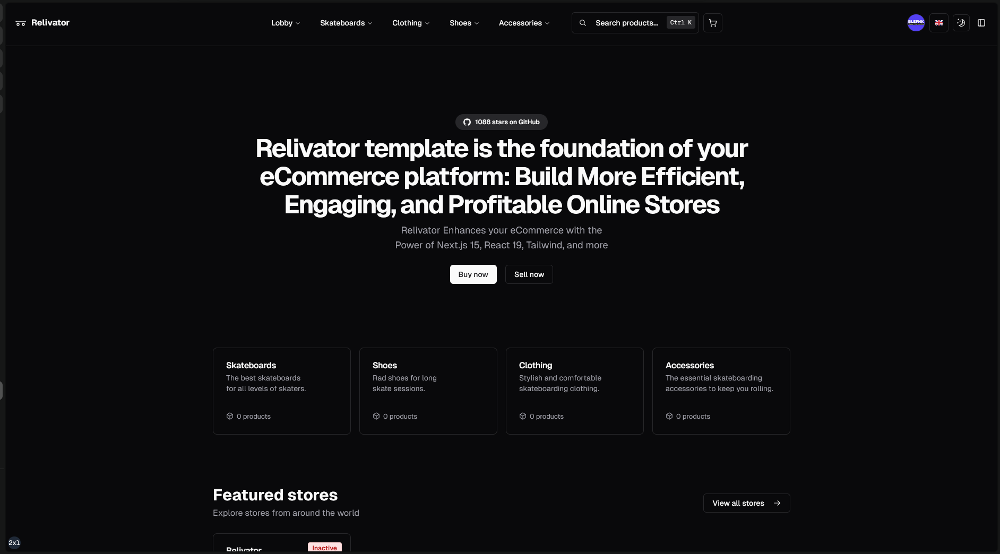

- [🚀 Demo](https://relivator.com/en)
- [💬 Discord](https://discord.gg/Pb8uKbwpsJ)
- [🧑‍💻 GitHub](https://github.com/blefnk/relivator)
- [💖 Patreon](https://patreon.com/blefnk)

## Get Started

_Make sure you have [Git](https://git-scm.com/downloads), [Node.js](https://nodejs.org/en), and [Bun](https://bun.sh) installed. Then:_

1. `bun i -g @reliverse/cli`
2. `reliverse cli`
3. Select _✨ Create a brand new project_
4. Provide/skip details about your project
5. It's ready, enjoy! 😊

## Tech Stack

- **Core**: [Next.js 15.2](https://nextjs.org), [React 19](https://react.dev), [TypeScript 5.8](https://typescriptlang.org)
- **Styling**: [Tailwind 4](https://tailwindcss.com/) & [shadcn/ui](https://ui.shadcn.com/)
- **Auth**: [Better Auth](https://better-auth.com)
- **Payments**: [Polar](https://polar.sh/)
- **Database**: [Drizzle](https://orm.drizzle.team) & [Neon](https://neon.tech)
- **File Storage**: [Uploadthing](https://uploadthing.com)
- **Tools**: [ESLint](https://eslint.org) + [Biome](https://biomejs.dev/) + [Knip](https://knip.dev)

:::note
Please note that Relivator, which was version 1.3.0, has been renamed to Versator. If you are interested in Clerk and Stripe instead of Better Auth and Polar, visit the Versator [repository](https://github.com/blefnk/versator) or its [documentation](/versator).
:::

## Help Relivator Grow

**If you find this project useful, please consider:**

- Starring [GitHub repo](https://github.com/blefnk/relivator)
- Supporting via [Patreon](https://patreon.com/blefnk), [GitHub Sponsors](https://github.com/sponsors/blefnk), or [PayPal](https://paypal.me/blefony)

## What is Relivator

The Relivator Next.js template serves as the foundation for your eCommerce platform, helping you create efficient, engaging, and profitable online stores.

## License

MIT. Project is created by [blefnk Nazar Kornienko](https://github.com/blefnk).
